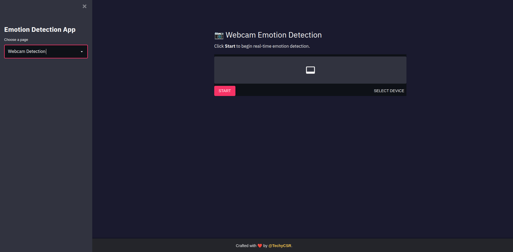

# Real-Time Emotion Detection Application


## 📖 About the Project
This Real-Time Emotion Detection application leverages a deep learning model to identify facial emotions in real-time through webcam feed. Built using OpenCV, Streamlit, and TensorFlow, it provides an interactive experience with:

- **Emotion recognition** using a custom-trained CNN model.
- **User-friendly interface** with modern UI design and animations.
- **Real-time results** for multiple emotions like Happy, Sad, Angry, and more.

---

## ⚙️ Project Requirements
To run this project, ensure you have the following installed:

- Python 3.9 or above
- TensorFlow 2.x
- OpenCV
- Streamlit
- Streamlit-WebRTC

### Additional Requirements
Install all dependencies by running:
```bash
pip install -r requirements.txt
```

---

## 🛠️ How to Install the Project
Follow these steps to set up the project on your local machine:

1. **Clone the repository:**
   ```bash
   git clone https://github.com/TechyCSR/Real-Time-Emotion-Detection
   cd Real-Time-Emotion-Detection
   ```

2. **Create a virtual environment (optional):**
   ```bash
   python -m venv venv
   source venv/bin/activate # On Windows: venv\Scripts\activate
   ```

3. **Install dependencies:**
   ```bash
   pip install -r requirements.txt
   ```

4. **Download the required model and cascade files:**
   - Place `emotion_model1.json` and `emotion_model1.h5` in the root directory.
   - Place `haarcascade_frontalface_default.xml` in the root directory.

---

## 🚀 How to Run the Project
To run the application locally, follow these commands:

1. **Run the Streamlit app:**
   ```bash
   streamlit run app.py
   ```

2. **Access the app in your browser:**
   Open [http://localhost:8501](http://localhost:8501) in your web browser.

3. **Use the app:**
   - Navigate to the "Webcam Detection" page.
   - Start the webcam and see real-time emotion detection in action!

---

## 📞 Contact Us
Have questions or suggestions? Reach out to us:

- **Web:** [TechyCSR Projects](https://projects.techycsr.me)
- **Email:** [csr.info.in@gmail.com](mailto:csr.info.in@gmail.com)
- **X (Twitter):** [@TechyCSR](https://twitter.com/TechyCSR)
- **LinkedIn:** [@TechyCSR](https://www.linkedin.com/in/techycsr)


---

## 🖼️ Preview


---

## 🛡️ License
This project is licensed under the MIT License. See the LICENSE file for details.

-
